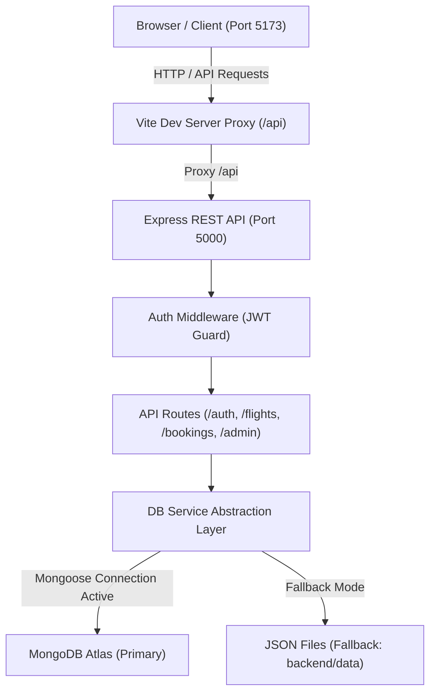

# 📐 Detailed Project Structure: SkyWings Full-Stack Architecture

This document outlines the detailed directory structure, module responsibilities, data flow, and development workflows for both the **Frontend** and **Backend** workspaces.

---

## 🏛️ High-Level Architecture



---

## 📂 Full Directory Breakdown

```text
flightbooking/
│
├── frontend/                                # CLIENT-SIDE APPLICATION (React + Vite)
│   ├── public/                              # Static public assets (unbundled)
│   │   ├── aeroplane-hero.png               # High-res airplane cutout graphic
│   │   ├── airplane.glb                     # 3D aircraft model for Three.js
│   │   ├── hero-flight.jpg                  # Hero banner photographic asset
│   │   └── vite.svg                         # Vite brand logo
│   │
│   ├── src/                                 # React application source code
│   │   ├── assets/                          # Bundled local images & static assets
│   │   │   ├── hero-flight.jpg              # Featured destination / hero fallback image
│   │   │   └── react.svg                    # React logo
│   │   │
│   │   ├── components/                      # Reusable UI & Feature Components
│   │   │   ├── AdminDashboard.jsx           # Flight management, statistics, and CRUD actions
│   │   │   ├── AuthModal.jsx                # Passenger sign-in, registration, and demo-login
│   │   │   ├── BoardingPassModal.jsx        # E-ticket / boarding pass with QR code presentation
│   │   │   ├── BookingModal.jsx             # 4-stage booking flow (Passenger info, add-ons, payment)
│   │   │   ├── FlightCanvas3D.jsx           # Three.js 3D interactive floating aircraft
│   │   │   ├── FlightCard.jsx               # Flight result card with pricing, times & badges
│   │   │   ├── FlightFilters.jsx            # Filter flights by stops, airlines, departure time
│   │   │   ├── FlightStatus.jsx             # Live flight status lookup by flight number or route
│   │   │   ├── Footer.jsx                   # Global footer with links, loyalty info, contact
│   │   │   ├── HeroSearch.jsx               # Search widget (Round trip, One way, Passengers, Date)
│   │   │   ├── HomePage.jsx                 # Home view combining search, destinations, and loyalty
│   │   │   ├── LandingPage.jsx              # Immersive cinematic landing hero section
│   │   │   ├── MyBookings.jsx               # User bookings overview with ticket view & cancel actions
│   │   │   ├── Navbar.jsx                   # Sticky navigation bar with brand, currency, & profile
│   │   │   ├── PopularDestinations.jsx      # Curated destination cards with real-time pricing
│   │   │   └── SeatSelectionModal.jsx       # Interactive seat layout (Economy, Business, First)
│   │   │
│   │   ├── context/                         # Global React Context State Providers
│   │   │   ├── AuthContext.jsx              # Holds authenticated user, JWT token, and login methods
│   │   │   └── CurrencyContext.jsx          # Dynamic currency conversion (USD, EUR, GBP, INR)
│   │   │
│   │   ├── services/                        # API & Network Integration
│   │   │   └── api.js                       # Centralized HTTP request layer for all endpoints
│   │   │
│   │   ├── styles/                          # Component-specific CSS stylesheets
│   │   │   ├── boardingpass.css             # Styling for printable boarding pass & bar/QR codes
│   │   │   ├── booking.css                  # Multi-step checkout styling
│   │   │   ├── dashboard.css                # Admin metrics grid & data tables
│   │   │   ├── flights.css                  # Flight search result list & filter styling
│   │   │   ├── footer.css                   # Footer navigation styles
│   │   │   ├── hero.css                     # Flight search banner & inputs styling
│   │   │   ├── HomePage.css                 # Homepage section wrapper styling
│   │   │   ├── index.css                    # Global typography, color palette, design tokens
│   │   │   ├── landingPage.css              # 3D canvas container & cinematic hero styling
│   │   │   ├── modal.css                    # Shared modal backdrop & dialog animations
│   │   │   ├── navbar.css                   # Header styles, responsive menu, currency dropdown
│   │   │   └── seatmap.css                  # Airplane fuselage seat map styling
│   │   │
│   │   ├── App.css                          # Application layout wrapper
│   │   ├── App.jsx                          # Main application router and state orchestration
│   │   ├── index.css                        # CSS reset & base variables
│   │   └── main.jsx                         # Application root render tree & Context injection
│   │
│   ├── .env.example                         # Example environment variables for frontend
│   ├── index.html                           # Single Page Application HTML document
│   ├── package.json                         # Frontend dependencies (React, Three.js, Lucide, Vite)
│   ├── vite.config.js                       # Vite build configuration and proxy setup
│   └── README.md                            # Frontend specific documentation
│
├── backend/                                 # SERVER-SIDE REST API (Node.js + Express + MongoDB)
│   ├── config/                              # Configuration & connection managers
│   │   └── db.js                            # MongoDB connection logic with auto-fallback status
│   │
│   ├── data/                                # Fallback persistent JSON datastore
│   │   ├── airports.json                    # Airport codes, names, cities, and countries
│   │   ├── bookings.json                    # Flight bookings, PNR records, seat allocations
│   │   ├── flights.json                     # Flight schedules, aircraft types, fare pricing
│   │   └── users.json                       # User accounts, password hashes, and roles
│   │
│   ├── middleware/                          # Express middleware functions
│   │   └── auth.js                          # JWT token validation & admin authorization guards
│   │
│   ├── models/                              # Mongoose Database Schemas
│   │   ├── Airport.js                       # Schema for airport entities
│   │   ├── Booking.js                       # Schema for booking records & passenger metadata
│   │   ├── Flight.js                        # Schema for flights, stops, duration, and seat matrix
│   │   └── User.js                          # Schema for users, credentials, and loyalty points
│   │
│   ├── routes/                              # Modular Express API Routes
│   │   ├── admin.js                         # /api/admin: Dashboard statistics and flight CRUD
│   │   ├── auth.js                          # /api/auth: Login, registration, profile, and demo auth
│   │   ├── bookings.js                      # /api/bookings: Create, lookup, and cancel bookings
│   │   └── flights.js                       # /api/flights: Query flights, seat availability, tracker
│   │
│   ├── services/                            # Business Logic & Data Abstraction
│   │   └── dbService.js                     # Unified CRUD service (switches between Mongo & JSON)
│   │
│   ├── utils/                               # Backend Helper Utilities
│   │   ├── db.js                            # Safe JSON file reader & writer
│   │   └── seed.js                          # Database seeder to import JSON into MongoDB
│   │
│   ├── .env.example                         # Example environment variables for backend
│   ├── app.js                               # Express app initialization, CORS, and route binding
│   ├── package.json                         # Backend dependencies (Express, Mongoose, JWT, bcrypt)
│   ├── server.js                            # Local HTTP server entry point (port listener)
│   └── README.md                            # Backend specific documentation
│
├── api/                                     # SERVERLESS FUNCTION HANDLER (Vercel)
│   └── index.js                             # Vercel entrypoint importing backend/app.js
│
├── .env.example                             # Root environment variable template
├── .gitignore                               # Git exclusions (node_modules, dist, env files)
├── eslint.config.js                         # ESLint configuration targeting frontend & backend
├── package.json                             # Root npm workspaces orchestrator
├── README.md                                # General project overview & setup guide
├── STRUCTURE.md                             # This architectural document
└── vercel.json                              # Cloud deployment configuration
```

---

## 🔄 Interaction & Data Flow

### 1. Flight Search & Booking Lifecycle
1. **User Action:** Passenger enters origin, destination, dates, and passengers on `frontend/src/components/HeroSearch.jsx`.
2. **Client Request:** `frontend/src/services/api.js` issues `GET /api/flights?from=JFK&to=LHR&date=...`.
3. **Proxy / Route:** Vite proxies `/api` to Express on port 5000; `backend/routes/flights.js` handles the request.
4. **Data Retrieval:** `backend/services/dbService.js` queries MongoDB (or `backend/data/flights.json` if MongoDB is offline).
5. **Selection & Seat Map:** Passenger chooses a flight; `SeatSelectionModal.jsx` displays available seats fetched via `/api/flights/:id/seats`.
6. **Checkout & PNR Generation:** `BookingModal.jsx` posts to `POST /api/bookings`. The server generates a unique 6-character PNR code and reserves seats.
7. **Confirmation & E-Ticket:** `BoardingPassModal.jsx` opens immediately with the passenger's confirmed digital boarding pass.

### 2. Authentication Flow
- **Registration / Login:** Handled by `backend/routes/auth.js`. Passwords hashed with `bcryptjs`.
- **JWT Issuance:** On successful credentials, a signed JWT token is returned.
- **Frontend Storage:** Stored in `localStorage` by `AuthContext.jsx`.
- **Authorized Requests:** `api.js` attaches `Authorization: Bearer <token>` to protected endpoints (`/api/bookings`, `/api/admin/*`).

---

## 💻 Available Commands (Root Workspace)

| Command | Action |
|---|---|
| `npm run dev` | Runs both **frontend** (Vite: 5173) and **backend** (Express: 5000) concurrently |
| `npm run frontend` | Runs only the **frontend** development server |
| `npm run backend` | Runs only the **backend** Express server with `--watch` |
| `npm run build` | Builds the **frontend** production bundle into `frontend/dist` |
| `npm run seed` | Seeds MongoDB collections with pre-populated records from `backend/data/` |
| `npm run preview` | Previews the production build locally |
| `npm run lint` | Runs ESLint across both frontend and backend directories |
